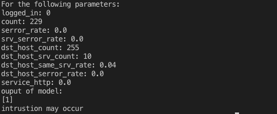

  

<h1 align="center">Log Based Intrusion Detection</h1>

<h4> In this project, we have developed a host-based intrusion detection system using logs generated by services running on the system. This system monitors the data received from user’s system log file and based on this data, notifies the user whether the system is susceptible to intrusion or not. </h4>

-----------------------------------------
### Inspiration

* The idea of making everything readily available and universally has led to a revolution in the field of networks. In spite of the tremendous growth of technologies in the field of networks and information, we still lack in preventing our resources from cyber-attacks. This is a serious issue as far as industries, companies or national securities are concerned. 

* A host-based intrusion detection system (HIDS) is a system that monitors a computer system on which it is installed to detect an intrusion and/or misuse, and responds by logging the activity and notifying the designated authority. In this project, we have developed a HIDS using logs generated by services running on the system.

------------------------------------------
### Working

* We have implemented a tool for detecting how susceptible the system is to intrusion based on some system parameters that can be retrieved from the system log files such as destination host count, destination host server count, serror rate, etc. These parameters are used to to train a machine learning model, which predicts on the basis of a given set of values for these parameters whether an intrusion may occur or the system is safe. The classification is achieved by means of a decision tree. 

* The training dataset is available online, while the test dataset can be extracted from the user’s system log file or any dataset available online can also be used. 

------------------------------------------
### Output

We are getting the following information as output:
* The data received from user’s system log file or train data i.e. parameters to be considered for intrusion detection.
* The predicted output of the model based on these parameters.
* Whether the system is susceptible to intrusion or not.

  

  
------------------------------------------
### Contributors

Mihir Gandhi - [mihir-m-gandhi](https://github.com/mihir-m-gandhi)

Devansh Solanki - [devanshslnk](https://github.com/devanshslnk/)

Siddharth Umachandar - [siddharth9805](https://github.com/siddharth9805/)

------------------------------------------
### License
This project is licensed under the MIT - see the [LICENSE](./LICENSE) file for details.
